# Database Schema Documentation

## Overview

VentaSaaS uses a **multi-tenant architecture** where all business data is isolated by `tenant_id`. The schema follows **Third Normal Form (3NF)** with UUID primary keys and automatic audit timestamps.

---

## Entity Relationship Diagram

```mermaid
erDiagram
    %% ═══════════════════════════════════════════════════════════════
    %% TENANT CORE - Central isolation layer
    %% ═══════════════════════════════════════════════════════════════
    
    tenants ||--o{ profiles : "has users"
    tenants ||--o{ user_roles : "assigns roles"
    tenants ||--o{ branches : "operates"
    tenants ||--o{ warehouses : "owns"
    tenants ||--o{ products : "sells"
    tenants ||--o{ product_categories : "organizes"
    tenants ||--o{ inventory : "tracks"
    tenants ||--o{ customers : "serves"
    tenants ||--o{ suppliers : "buys from"
    tenants ||--o{ sales_invoices : "creates"
    tenants ||--o{ purchase_invoices : "receives"
    tenants ||--|| subscriptions : "subscribes to"
    
    %% ═══════════════════════════════════════════════════════════════
    %% ORGANIZATION STRUCTURE
    %% ═══════════════════════════════════════════════════════════════
    
    branches ||--o{ warehouses : "contains"
    branches ||--o{ sales_invoices : "processes"
    
    warehouses ||--o{ inventory : "stores"
    warehouses ||--o{ purchase_invoices : "receives stock"
    
    %% ═══════════════════════════════════════════════════════════════
    %% PRODUCT & INVENTORY
    %% ═══════════════════════════════════════════════════════════════
    
    products ||--o{ inventory : "tracked in"
    products ||--o{ sales_invoice_items : "sold as"
    products ||--o{ purchase_invoice_items : "purchased as"
    products }o--|| product_categories : "belongs to"
    
    %% ═══════════════════════════════════════════════════════════════
    %% SALES FLOW
    %% ═══════════════════════════════════════════════════════════════
    
    customers ||--o{ sales_invoices : "places"
    sales_invoices ||--o{ sales_invoice_items : "contains"
    
    %% ═══════════════════════════════════════════════════════════════
    %% PURCHASE FLOW
    %% ═══════════════════════════════════════════════════════════════
    
    suppliers ||--o{ purchase_invoices : "fulfills"
    purchase_invoices ||--o{ purchase_invoice_items : "contains"
    
    %% ═══════════════════════════════════════════════════════════════
    %% PLATFORM MANAGEMENT (Global - no tenant isolation)
    %% ═══════════════════════════════════════════════════════════════
    
    subscription_plans ||--o{ subscriptions : "defines pricing"
    
    support_tickets ||--o{ ticket_messages : "has conversation"
    
    platform_admins ||--o{ admin_audit_log : "generates"
    platform_admins ||--o{ platform_announcements : "publishes"

    %% ═══════════════════════════════════════════════════════════════
    %% TABLE DEFINITIONS
    %% ═══════════════════════════════════════════════════════════════

    tenants {
        uuid id PK
        text name
        text email
        text phone
        text address
        text tax_id
        text website
        text logo_url
        timestamptz created_at
        timestamptz updated_at
    }

    profiles {
        uuid id PK
        uuid user_id FK
        uuid tenant_id FK
        text full_name
        text avatar_url
        timestamptz created_at
        timestamptz updated_at
    }

    user_roles {
        uuid id PK
        uuid user_id FK
        uuid tenant_id FK
        app_role role
        timestamptz created_at
    }

    branches {
        uuid id PK
        uuid tenant_id FK
        text name
        boolean is_main
        text manager_name
        text phone
        text address
        timestamptz created_at
        timestamptz updated_at
    }

    warehouses {
        uuid id PK
        uuid tenant_id FK
        uuid branch_id FK
        text name
        text address
        integer capacity
        timestamptz created_at
        timestamptz updated_at
    }

    products {
        uuid id PK
        uuid tenant_id FK
        uuid category_id FK
        text name
        text description
        text sku
        text barcode
        numeric cost
        numeric price
        numeric tax_rate
        integer quantity
        integer min_stock
        text size
        text image_url
        boolean is_active
        boolean has_serial_tracking
        jsonb custom_fields
        timestamptz created_at
        timestamptz updated_at
    }

    product_categories {
        uuid id PK
        uuid tenant_id FK
        text name
        text description
        timestamptz created_at
        timestamptz updated_at
    }

    inventory {
        uuid id PK
        uuid tenant_id FK
        uuid product_id FK
        uuid warehouse_id FK
        integer quantity
        timestamptz created_at
        timestamptz updated_at
    }

    customers {
        uuid id PK
        uuid tenant_id FK
        text name
        text customer_type
        text first_name
        text last_name
        text contact_person
        text email
        text phone
        text address
        text city
        text tax_id
        timestamptz created_at
        timestamptz updated_at
    }

    suppliers {
        uuid id PK
        uuid tenant_id FK
        text name
        text representative
        text email
        text phone
        text address
        text tax_id
        timestamptz created_at
        timestamptz updated_at
    }

    sales_invoices {
        uuid id PK
        uuid tenant_id FK
        uuid branch_id FK
        uuid customer_id FK
        uuid created_by FK
        text invoice_number
        date invoice_date
        text status
        numeric subtotal
        numeric tax_amount
        numeric discount_amount
        numeric total
        text notes
        timestamptz created_at
        timestamptz updated_at
    }

    sales_invoice_items {
        uuid id PK
        uuid tenant_id FK
        uuid invoice_id FK
        uuid product_id FK
        integer quantity
        numeric unit_price
        numeric tax_rate
        numeric subtotal
        text[] serial_numbers
        timestamptz created_at
    }

    purchase_invoices {
        uuid id PK
        uuid tenant_id FK
        uuid supplier_id FK
        uuid warehouse_id FK
        uuid created_by FK
        text invoice_number
        date invoice_date
        text status
        numeric subtotal
        numeric tax_amount
        numeric total
        text notes
        timestamptz created_at
        timestamptz updated_at
    }

    purchase_invoice_items {
        uuid id PK
        uuid tenant_id FK
        uuid invoice_id FK
        uuid product_id FK
        integer quantity
        numeric unit_cost
        numeric subtotal
        text[] serial_numbers
        timestamptz created_at
    }

    subscriptions {
        uuid id PK
        uuid tenant_id FK
        uuid plan_id FK
        subscription_status status
        text billing_cycle
        text stripe_customer_id
        text stripe_subscription_id
        timestamptz current_period_start
        timestamptz current_period_end
        boolean cancel_at_period_end
        timestamptz created_at
        timestamptz updated_at
    }

    subscription_plans {
        uuid id PK
        text name
        text description
        numeric price_monthly
        numeric price_yearly
        integer max_users
        integer max_products
        integer max_branches
        jsonb features
        boolean is_active
        text stripe_price_id_monthly
        text stripe_price_id_yearly
        timestamptz created_at
        timestamptz updated_at
    }

    support_tickets {
        uuid id PK
        uuid tenant_id FK
        uuid created_by FK
        uuid assigned_to FK
        text subject
        ticket_status status
        ticket_priority priority
        ticket_category category
        timestamptz resolved_at
        timestamptz created_at
        timestamptz updated_at
    }

    ticket_messages {
        uuid id PK
        uuid ticket_id FK
        uuid sender_id FK
        text message
        boolean is_internal
        jsonb attachments
        timestamptz created_at
    }

    platform_admins {
        uuid id PK
        uuid user_id FK
        platform_role role
        timestamptz created_at
        timestamptz updated_at
    }

    admin_audit_log {
        uuid id PK
        uuid admin_id FK
        text action
        text entity_type
        uuid entity_id
        jsonb details
        text ip_address
        timestamptz created_at
    }

    platform_announcements {
        uuid id PK
        uuid created_by FK
        text title
        text content
        text type
        boolean is_active
        timestamptz starts_at
        timestamptz ends_at
        uuid[] target_plans
        timestamptz created_at
        timestamptz updated_at
    }
```



---

## Table Categories

### Tenant-Isolated Tables (14)

These tables contain business data scoped to a specific tenant via `tenant_id`:

| Table | Purpose |
|-------|---------|
| `profiles` | User profile information |
| `user_roles` | Role assignments per tenant |
| `branches` | Physical business locations |
| `warehouses` | Storage facilities within branches |
| `products` | Product catalog |
| `product_categories` | Product organization |
| `inventory` | Stock levels per warehouse |
| `customers` | Customer records |
| `suppliers` | Supplier/vendor records |
| `sales_invoices` | Sales transaction headers |
| `sales_invoice_items` | Sales line items |
| `purchase_invoices` | Purchase transaction headers |
| `purchase_invoice_items` | Purchase line items |
| `support_tickets` | Customer support requests |

### Platform Tables (7)

These tables manage the SaaS platform globally:

| Table | Purpose |
|-------|---------|
| `tenants` | Company/organization records |
| `subscriptions` | Tenant subscription status |
| `subscription_plans` | Available pricing plans |
| `platform_admins` | Platform administrator accounts |
| `admin_audit_log` | Admin action tracking |
| `platform_announcements` | System-wide notifications |
| `ticket_messages` | Support ticket conversations |

---

## Normalization Notes

### Third Normal Form (3NF) Compliance

1. **1NF**: All columns contain atomic values
2. **2NF**: No partial dependencies on composite keys (uses UUID surrogate keys)
3. **3NF**: No transitive dependencies

### Intentional Denormalizations

| Pattern | Reason |
|---------|--------|
| `total` on invoices | Query performance - avoids recalculating |
| `tenant_id` on child tables | RLS performance - direct policy checks |
| `serial_numbers` as `TEXT[]` | Simplicity - avoids junction table |
| `JSONB` fields | Flexibility for custom data |

---

## Custom Types (ENUMs)

```sql
-- User roles within a tenant
CREATE TYPE app_role AS ENUM ('admin', 'user');

-- Platform administrator roles
CREATE TYPE platform_role AS ENUM ('super_admin', 'support_agent');

-- Subscription lifecycle
CREATE TYPE subscription_status AS ENUM (
  'active', 'canceled', 'past_due', 'trialing', 'inactive'
);

-- Support ticket workflow
CREATE TYPE ticket_status AS ENUM (
  'open', 'in_progress', 'waiting_customer', 'resolved', 'closed'
);

CREATE TYPE ticket_priority AS ENUM ('low', 'medium', 'high', 'urgent');

CREATE TYPE ticket_category AS ENUM (
  'billing', 'technical', 'feature_request', 'general'
);
```

---

## Key Relationships

### Sales Flow
```
Customer → Sales Invoice → Sales Invoice Items ← Product
                ↓
              Branch
```

### Purchase Flow
```
Supplier → Purchase Invoice → Purchase Invoice Items ← Product
                 ↓
             Warehouse
```

### Inventory Tracking
```
Product ←→ Inventory ←→ Warehouse ← Branch ← Tenant
```

---

## Row Level Security (RLS)

All tables have RLS enabled with policies based on:

- **`is_member_of_tenant(tenant_id)`** - Read access for tenant members
- **`is_admin_of_tenant(tenant_id)`** - Write/delete access for admins
- **`is_platform_admin()`** - Full access for platform admins

---

## Statistics

| Metric | Count |
|--------|-------|
| Total Tables | 21 |
| Tables with RLS | 21 (100%) |
| Tenant-isolated tables | 14 |
| Platform tables | 7 |
| Custom ENUMs | 6 |
| Database Functions | 9 |
